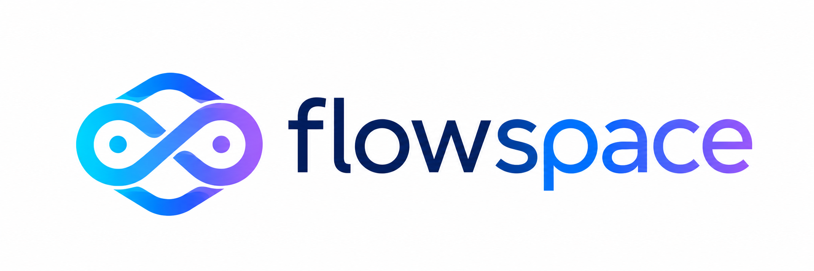

<div align="center">
  
  <br /><br />
  <p><strong>Workspace local com Kanban, notas rich-text e player de música — 100% offline.</strong></p>

  
  
  
  
  
  

  <br />

  [📥 Download Instalador](#instalação) · [🚀 Funcionalidades](#funcionalidades) · [🛠 Tech Stack](#tech-stack) · [🤝 Contribuir](#contribuindo)

</div>

---

## O que é o Flowspace?

Flowspace é um **aplicativo desktop para Windows** que centraliza seu fluxo de produtividade em um único lugar:

- **Kanban** estilo Trello para gerenciar tarefas com drag & drop
- **Editor de notas** estilo Notion com formatação rich-text
- **Player de música** integrado (arquivos locais MP3/FLAC + Spotify)
- **Biblioteca de estudos** com timer Pomodoro e links curados
- **8 temas visuais** com modo escuro e claro
- **100% offline** — seus dados ficam no seu computador, em SQLite local

> Ideal para desenvolvedores, estudantes e profissionais que buscam foco sem depender de SaaS.

---

## Funcionalidades

### 📋 Kanban Board
- Múltiplos boards com cores personalizadas
- Colunas renomeáveis e reordenáveis
- Cards com título, descrição e música vinculada
- Drag & drop entre colunas com `@dnd-kit`
- Exclusão em cascata (board → colunas → cards)

### 📝 Notas Rich-Text
- Editor completo com **TipTap** (headings, bold, italic, listas, checklists, blocos de código, citações, links)
- Auto-save com debounce de 1s
- Emoji customizável por nota
- Vinculação de música Spotify por nota

### 🎵 Player de Música
- **Arquivos locais** — MP3, FLAC, OGG, WAV, AAC, M4A (100% offline)
- **Spotify** — OAuth PKCE, controles de playback, busca de faixas, polling em tempo real
- Player flutuante com progresso, skip e volume
- Integrado ao Kanban e Notas

### 📚 Biblioteca & Pomodoro
- Links curados (MDN, Khan Academy, freeCodeCamp, etc.)
- Timer Pomodoro integrado
- Rastreamento de tempo de estudo por dia

### 🎨 Temas & Acessibilidade
- 8 temas: Escuro, Meia-noite, Oceano, Floresta, Pôr do Sol, Claro, Violeta, Monokai
- Tamanho de fonte configurável
- Redução de movimento, alto contraste, foco por teclado

---

## Tech Stack

| Camada | Tecnologia |
|--------|-----------|
| **Runtime desktop** | [Tauri v2](https://tauri.app) (Rust + WebView) |
| **UI Framework** | React 18 + TypeScript |
| **Estilização** | Tailwind CSS 3 + CSS Variables (theming) |
| **Animações** | Framer Motion |
| **Roteamento** | React Router DOM v6 |
| **Estado global** | Zustand (com persist) |
| **Editor** | TipTap (extensões: TaskList, Placeholder, Link, Typography) |
| **Drag & Drop** | @dnd-kit/core + @dnd-kit/sortable |
| **Banco de dados** | SQLite via `@tauri-apps/plugin-sql` |
| **Persistência** | `@tauri-apps/plugin-store` (tokens e preferências) |
| **Auth música** | Spotify OAuth 2.0 PKCE (sem backend) |
| **Icons** | Lucide React |
| **Datas** | date-fns |
| **Build** | Vite 6 + TypeScript |

### Arquitetura
```
src/
├── components/
│   ├── layout/        # Sidebar, TitleBar, DashboardLayout
│   ├── kanban/        # KanbanBoard, KanbanColumn, KanbanCard
│   ├── editor/        # NoteEditor (TipTap)
│   ├── music/         # LocalPlayer, LocalFileInput
│   ├── spotify/       # FloatingPlayer, SpotifySearch, NowPlaying
│   └── providers/     # ThemeProvider
├── pages/             # Dashboard, Boards, BoardDetail, Notes, NoteDetail, Library, Settings
├── lib/
│   ├── db.ts          # SQLite CRUD (boards, columns, cards, notes)
│   └── spotify.ts     # OAuth PKCE + API calls
├── store/
│   ├── index.ts       # Spotify store (Zustand)
│   ├── localPlayer.ts # Local audio player store
│   └── theme.ts       # Theme + accessibility store (persisted)
└── App.tsx            # Router, init, splash
src-tauri/
├── src/lib.rs         # Rust: OAuth callback server, app setup
├── tauri.conf.json    # Configuração do app
└── nsis/hooks.nsi     # Instalador NSIS customizado
```

---

## Instalação

### Download direto (recomendado)

Baixe o instalador na [página de Releases](https://github.com/jovemegidio/flowspace/releases/latest):

| Formato | Arquivo | Quando usar |
|---------|---------|-------------|
| **NSIS** | `Flowspace_0.1.0_x64-setup.exe` | Instalação padrão (recomendado) |
| **MSI** | `Flowspace_0.1.0_x64_en-US.msi` | Deploy corporativo / Group Policy |

> **Requisitos:** Windows 10 (64-bit) ou superior. O instalador inclui o WebView2 automaticamente.

---

## Rodando em desenvolvimento

### Pré-requisitos
- [Node.js](https://nodejs.org) 18+
- [Rust](https://rustup.rs) (stable)
- [Tauri CLI](https://tauri.app/start/prerequisites/) v2

```bash
# 1. Clone o repositório
git clone https://github.com/jovemegidio/flowspace.git
cd flowspace

# 2. Instale as dependências
npm install

# 3. Rode em modo dev (com hot-reload)
npm run tauri:dev
```

### Build para produção

```bash
npm run tauri:build
# Instaladores gerados em: src-tauri/target/release/bundle/
```

### Comandos disponíveis

| Comando | Descrição |
|---------|-----------|
| `npm run dev` | Servidor Vite (somente frontend) |
| `npm run tauri:dev` | App Tauri com hot-reload |
| `npm run tauri:build` | Gera instaladores NSIS + MSI |
| `npm run build` | Build do frontend (Vite) |

---

## Configurar Spotify (opcional)

1. Acesse [developer.spotify.com/dashboard](https://developer.spotify.com/dashboard) e crie um app
2. Em **Settings**, adicione o Redirect URI:
   ```
   http://localhost:8765/callback
   ```
3. Copie o **Client ID**
4. No Flowspace, vá em **Configurações → Spotify** e cole o Client ID

> Spotify Premium é necessário para controlar o playback remotamente.

---

## Screenshots

| Dashboard | Kanban Board | Editor de Notas |
|-----------|-------------|-----------------|
| *(em breve)* | *(em breve)* | *(em breve)* |

---

## Contribuindo

Contribuições são bem-vindas! Siga o fluxo:

```bash
# Fork e clone
git clone https://github.com/seu-usuario/flowspace.git

# Crie uma branch
git checkout -b feat/minha-feature

# Commit com conventional commits
git commit -m "feat: adicionar suporte a X"

# Push e abra um Pull Request
git push origin feat/minha-feature
```

### Roadmap

- [ ] Due dates e labels em cards do Kanban
- [ ] Player YouTube integrado
- [ ] Exportar notas como Markdown / PDF
- [ ] Suporte a múltiplos idiomas (i18n)
- [ ] Sincronização via WebDAV (opcional, mantendo offline-first)
- [ ] Temas customizáveis pelo usuário
- [ ] Atalhos de teclado configuráveis

---

## Licença

MIT © [Egidio](https://github.com/jovemegidio)

---

<div align="center">
  <sub>Feito com ☕ e muito foco. Flowspace — seu espaço de trabalho, do seu jeito.</sub>
</div>
